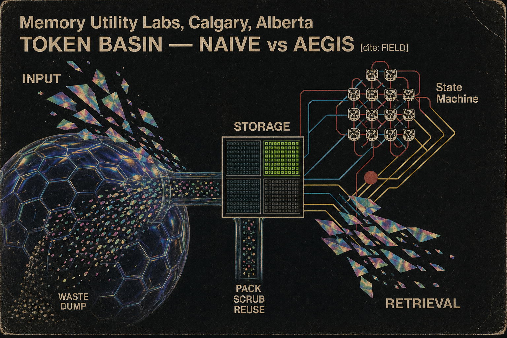
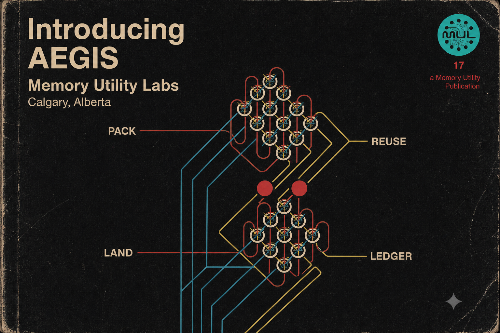
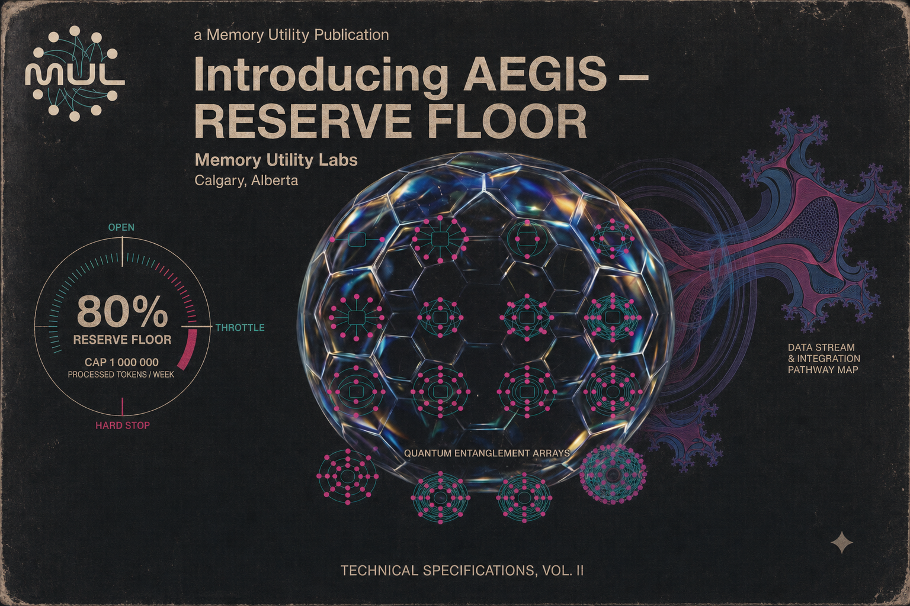

# Introducing AEGIS

**A Memory Utility Publication · Memory Utility Labs / Calgary, Alberta**

Formatted volume: [Introducing AEGIS Draft 2 (PDF)](book/Introducing-AEGIS-draft2.pdf) — 9×6 landscape, 23 pages, geodesic plates facing each chapter. Rebuild: `python3 docs/book/build_book.py`. Prior Pelican draft: [Draft 1](book/Introducing-AEGIS.pdf). Volume II (system architecture): [Introducing AEGIS Vol. II](book/Introducing-AEGIS-vol2.pdf) — rebuild `python3 docs/book/build_vol2.py`.


Aegis is an operating system for AI coding work. Kernel (process / memory / drivers / syscalls). Portable data plane under `~/.aegis/`. Frozen `/v1` API. Honest yield proof.

Tokens are finite inventory. Waste is failure. Pack context. Gate tools. Land receipts. Ledger everything.

This volume is the publication of record for that posture. No enthusiasm theater. No soft efficiency lies. Where a number is not yet proven, the number stays null.

## Token basin



The field card binds the work to one law: **tokens are water.** They are not free. Pack and scrub before discharge. A reserve is a low-flow state, not an empty one.

The naive path is a single-purpose dam — one context window, filled with re-read files and whole-tree dumps, spilling over every turn. The Aegis path is a comprehensive basin: pack once, reuse while bytes are unchanged, land a receipt when work ships, ledger so the next session starts from evidence.

Drift and unread dumps are oxygen debt. They compound quietly. Aegis is aggressive on drift because drift is aggressive on you.

**Naive:** dump → overflow → re-read.  
**Aegis:** pack + reserve + implement-full + land + audit.

## Core loop



```text
pack once → reuse while bytes unchanged → land → ledger
```

- **PACK.** `aegis pack --mode implement path.py` builds a content-addressed context pack. Explore ships signatures. Implement ships full target bodies — never skeleton-only on an edit path.
- **REUSE.** A later pack over a subset of the same files hits if hashes still match. Task change does not bust reuse. **Edits do** — on purpose. Aim: ≥50% hit rate.
- **LAND.** `aegis land --body-file final.txt --summary "what shipped"` shrinks the final, stores it, indexes it.
- **LEDGER.** `~/.aegis/ledger.jsonl` is source of truth for all token economics. If it is not in the ledger, it did not happen.

Around the loop: process table, syscall stats, gates that fail closed on unknown, malformed, or out-of-scope requests.

## Reserve floor



Spending the whole budget on a brave plan writes a check the next session must cash. Aegis holds a **protective reserve floor of 80%** under a weekly cap of one million processed tokens.

| State | Condition | Posture |
|---|---|---|
| OPEN | reserve ≥ 80% | invest permitted |
| THROTTLE | reserve cold | tools + reuse only; invest frozen; no parallel fan-out |
| HARD STOP | reserve exhausted | explore / reuse only |

Surplus is not decoration. Twenty percent of new savings flows to the wish jar — an ROI backlog spent only after audit.

## Honest yield


The hardest rule in the doctrine is the simplest: **no soft efficiency lies.** `savings_percent` is observed billed USD on `matched_provider_pairs`. It is not a pack guess. It is not an AA rank.

**D-040.** Routing is on for tiny chat only: explore/review `deepseek/deepseek-v4-pro` may swap to `openai/gpt-5.4-nano`. Implement packs stay on the requested model — those receipts cost more, not less. `coding_prompt_scale` and `aegis_pack_scale` stay unrouted. Ledger tok reduction is `chars/4` counterfactual and is not `savings_percent`.

Live report on this machine (`aegis yield report`):

| Workflow | Pairs | Savings % | Route |
|---|---:|---:|---|
| matched_provider_pairs (tiny chat) | 20 | **41.3** | **on** |
| D-039 subset (pro vs nano) | 10 | 82.7 | included above |
| D-038 subset (same model) | 10 | 0.0 | no cut |
| coding_prompt_scale | 5 | **−394.3** | off |
| aegis_pack_scale (implement) | 5 | **−2472.8** | off |
| ledger pack reduction | — | 32.1 tok (chars/4, not USD) | not routing |

`routing_scope=tiny_chat`. Tests: 397 passed.

That is the difference between a dashboard and a ledger. One flatters. The other holds.

## Install

```bash
python3 -m pip install --user -e .
python3 -m aegis os init
python3 -m aegis doctor --product
python3 -m aegis os ready
```

Reduce · reuse · recycle. Pack context. Gate tools. Land receipts. Ledger everything.

The window will close. The basin remains.

---

*Aegis 1.2.0 — see [EVOLUTION.md](EVOLUTION.md) · [ABSOLUTE.md](ABSOLUTE.md) · [FIELD.md](FIELD.md). Plates: Memory Utility Labs design language (1970s technical manual / geodesic schematic).*
