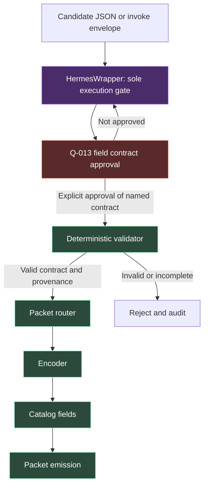

# Semantic Packet Field Contract

**Status:** proposed. Not approved. Q-013 remains `locked-observe`.

`HermesWrapper` is the only execution gate.

## Six field decisions

- **Mint `pkt_<uuid4>`** at admission. Never copy `request_id` / `trace_id` / `event_id` / `tool_call_id`.
- **Use `parent_id`** as the sole parent. Root intent `null`. Drop `provenance.parent`. Note hops are not parents.
- **Default** `confidence=unknown`, `priority=normal`, `retry_count=0`, maximum 2 then `dead_letter`.
- **Keep sensitivity** separate from redaction. Default `internal`. Redaction does not mean `secret`.
- **Cite `run_id`** without merging it into `GateResult`.
- **Bind `token_budget`** to characters until D-016. Never label chars as tokens. Keep `cost_estimate` null.

## Boundary

No encoder, catalog field, packet emission, router, second gate, D-025, AGIS/05, or `memory.write`.



Current edge: **Not approved → B**. C–G stay unauthorized until a later execute brief.

## Rejected

Reuse `request_id` as `packet_id`. Dual parent fields. Infer `confidence=high`. Treat `[REDACTED]` as `secret`. Add `run_id` to `GateResult`. Call chars tokens.

## Unresolved (block encoder only)

`provenance.citations` shape. `source` enum. Conceptual admission mint. Q-013 status after approval vs execute brief.

## Approval

Not executed. Copy verbatim:

```text
I approve docs/SEMANTIC_PACKET_FIELD_CONTRACT.md as the Q-013 field contract.
This accepts the six field decisions only.
It does not authorize an encoder, router, catalog field, packet emission, D-025, or a second gate.
HermesWrapper remains the only execution gate.
```
